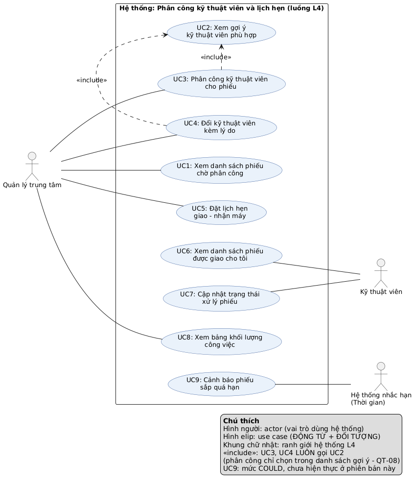

# Đặc tả yêu cầu phần mềm (SRS rút gọn)
## Luồng L4 – Phân công kỹ thuật viên và lịch hẹn giao – nhận máy bảo hành

| | |
|---|---|
| **Sinh viên** | Nguyễn Thái Đức – MSSV 2374802010117 – Track SE |
| **Học phần** | Chuyên đề Tốt nghiệp 1 – HK1 2026–2027 – Trường ĐH Văn Lang |
| **Case study** | Smart CRM – Mekong Mobile |
| **Phiên bản** | 1.0 (BT1) |
| **Chuẩn tham chiếu** | Rút gọn theo tinh thần ISO/IEC/IEEE 29148 (không tuân thủ đầy đủ) |

---

## 1. Giới thiệu và phạm vi

### 1.1. Bối cảnh
Mekong Mobile có 6 trung tâm bảo hành, 38 kỹ thuật viên, trung bình 260 yêu cầu bảo hành mỗi tháng. Hiện nay quản lý trung tâm phân công phiếu **theo trí nhớ**. Hệ quả đo được (Bảng 2.2 case study):

- **V3:** khối lượng lệch nhau, có kỹ thuật viên nhận 40 phiếu/tháng, người khác chỉ 12 phiếu.
- **V2:** không ai biết phiếu đang ở bước nào, ai đang xử lý; khoảng 15% phiếu quá hạn cam kết mà không được cảnh báo.
- Quản lý mất gần một ngày cuối tháng để đếm tay số phiếu quá hạn (phát biểu chị Trâm, Mục 4).

### 1.2. Phạm vi (một câu)
> Quản lý trung tâm phân công phiếu bảo hành đang ở trạng thái **Mới** cho kỹ thuật viên phù hợp theo tay nghề, trung tâm và khối lượng công việc, đặt lịch hẹn giao – nhận máy không trùng lịch, rồi theo dõi phiếu cho đến khi chuyển sang **Hoàn tất**.

**Điểm bắt đầu:** phiếu đã tồn tại ở trạng thái Mới (do luồng L2 tạo; trong học phần này dùng dữ liệu mẫu `tickets_history.csv`).
**Điểm kết thúc:** phiếu ở trạng thái Hoàn tất.

### 1.3. Điều CHỦ Ý KHÔNG làm (WON'T)

| Mã | Không làm | Lý do |
|---|---|---|
| W1 | Tiếp nhận phiếu, phân loại nhóm sự cố, sinh hạn cam kết | Thuộc luồng L2; L4 chỉ đọc `due_date` đã có |
| W2 | Xuất linh kiện, quản lý tồn kho | Thuộc luồng L5; L4 chỉ ghi nhận trạng thái Chờ linh kiện |
| W3 | Đóng phiếu khi khách nhận máy, khảo sát hài lòng | Thuộc luồng L8 / ngoài điểm kết thúc của L4 |
| W4 | Khách hàng tự đặt lịch hẹn trực tuyến | Khách không thao tác trực tiếp trên hệ thống |
| W5 | Gửi SMS/Zalo nhắc lịch hẹn | Cần tích hợp hệ thống ngoài, vượt phạm vi cá nhân |
| W6 | Phân công tự động hoàn toàn không cần người duyệt | Hệ thống chỉ gợi ý; quản lý giữ quyền quyết định |
| W7 | Đăng nhập, quản lý tài khoản, phân quyền đầy đủ | Là hạ tầng; phiên bản này giả lập 2 vai trò |

### 1.4. Thuật ngữ (trích Bảng 3.1 case study, dùng thống nhất trong mọi tài liệu và sơ đồ)

| Thuật ngữ | Định nghĩa | Tên kỹ thuật |
|---|---|---|
| Phiếu bảo hành | Một yêu cầu bảo hành/sửa chữa đã ghi nhận, có mã duy nhất và vòng đời trạng thái | `ticket` |
| Trạng thái phiếu | Mới → Đã phân công → Đang xử lý → Chờ linh kiện → Hoàn tất → Đã đóng; Mới/Đã phân công → Đã hủy | `ticket_status` |
| Hạn cam kết | Thời điểm chậm nhất phải hoàn tất phiếu, sinh theo QT-04 | `due_date` |
| Nhóm sự cố | Màn hình, pin, sạc, phần mềm, nước vào, khác | `issue_category` |
| Mức ưu tiên | Cao, Trung bình, Thấp | `priority` |
| Kỹ thuật viên | Nhân viên sửa chữa, thuộc một trung tâm, có tay nghề theo nhóm sự cố | `technician` |
| Tay nghề | Mức thành thạo 1–5 của kỹ thuật viên với một nhóm sự cố | `technician_skill.proficiency` |
| Lịch hẹn | Khung thời gian đã hẹn giữa khách và kỹ thuật viên để giao – nhận thiết bị | `appointment` |
| Phiếu đang mở | Phiếu ở trạng thái Đã phân công, Đang xử lý hoặc Chờ linh kiện | — |
| Khối lượng công việc | Số phiếu đang mở mà một kỹ thuật viên đang giữ | — |
| Phiếu sắp quá hạn | Phiếu chưa Hoàn tất và còn dưới 24 giờ tới hạn cam kết | — |
| Phiếu quá hạn | Phiếu chưa Hoàn tất và đã vượt hạn cam kết | — |

---

## 2. Các bên liên quan và vai trò người dùng

| Actor | Loại | Được làm | KHÔNG được làm |
|---|---|---|---|
| **Quản lý trung tâm** | Người, actor chính | Xem phiếu chờ phân công; xem gợi ý; phân công và đổi kỹ thuật viên; đặt lịch hẹn; xem bảng khối lượng công việc của **trung tâm mình** | Xem hoặc phân công phiếu của trung tâm khác (QT-14); xóa phiếu (QT-13) |
| **Kỹ thuật viên** | Người | Xem phiếu **được giao cho mình**; cập nhật trạng thái xử lý theo vòng đời | Tự nhận hoặc tự chuyển phiếu cho người khác; xem phiếu của người khác; thấy số điện thoại đầy đủ của khách (QT-15) |
| **Hệ thống nhắc hạn** | Thời gian, actor phụ | Định kỳ phát hiện phiếu sắp quá hạn / quá hạn (mức COULD) | — |
| Khách hàng | Người hưởng lợi | Không thao tác trực tiếp; quản lý đặt lịch hẹn thay khách | — |

---

## 3. Yêu cầu chức năng

### 3.1. Danh sách yêu cầu chức năng

| Mã | Yêu cầu chức năng (kiểm chứng được) |
|---|---|
| **FR1** | Hệ thống hiển thị danh sách phiếu ở trạng thái Mới thuộc trung tâm của quản lý, sắp xếp theo hạn cam kết tăng dần, lọc được theo nhóm sự cố và mức ưu tiên, phân trang tối đa 20 phiếu/trang. |
| **FR2** | Với một phiếu, hệ thống gợi ý tối đa 3 kỹ thuật viên thỏa đồng thời: đang làm việc, cùng trung tâm với phiếu, tay nghề ≥ 3 ở nhóm sự cố của phiếu; sắp xếp theo số phiếu đang mở tăng dần, nếu bằng nhau thì theo tay nghề giảm dần. |
| **FR3** | Hệ thống cho phép quản lý phân công phiếu ở trạng thái Mới cho đúng một kỹ thuật viên trong danh sách gợi ý; sau khi phân công, phiếu chuyển sang Đã phân công và một dòng lịch sử trạng thái được ghi kèm thời điểm và người thực hiện. |
| **FR4** | Hệ thống cho phép quản lý đổi kỹ thuật viên của phiếu đang mở; lý do đổi là bắt buộc (10–255 ký tự); hệ thống ghi lại kỹ thuật viên cũ, kỹ thuật viên mới, lý do, thời điểm và người đổi. |
| **FR5** | Hệ thống cho phép quản lý tạo lịch hẹn giao máy hoặc trả máy cho phiếu đã có kỹ thuật viên; hệ thống từ chối lịch hẹn nếu khung giờ giao nhau với một lịch hẹn khác chưa hủy của cùng kỹ thuật viên. |
| **FR6** | Hệ thống hiển thị cho kỹ thuật viên danh sách phiếu đang mở được giao cho chính họ, sắp theo hạn cam kết tăng dần, đánh dấu riêng phiếu sắp quá hạn và phiếu quá hạn. |
| **FR7** | Hệ thống cho phép kỹ thuật viên chuyển trạng thái phiếu của mình theo đúng vòng đời Hình 6.2 (Đã phân công → Đang xử lý; Đang xử lý → Chờ linh kiện hoặc Hoàn tất; Chờ linh kiện → Hoàn tất); từ chối mọi chuyển trạng thái khác. |
| **FR8** | Hệ thống hiển thị cho quản lý bảng khối lượng công việc của trung tâm: với mỗi kỹ thuật viên gồm số phiếu đang mở, số phiếu sắp quá hạn và số phiếu quá hạn tại thời điểm xem. |
| **FR9** | Hệ thống định kỳ mỗi giờ đánh dấu phiếu sắp quá hạn, phiếu quá hạn và phiếu nằm ở Chờ linh kiện quá 3 ngày, hiển thị cảnh báo cho quản lý trung tâm. *(COULD)* |

### 3.2. User Story và mức ưu tiên MoSCoW

| Mã | User Story | MoSCoW | Nguồn |
|---|---|---|---|
| **US1** | Là **quản lý trung tâm**, tôi muốn xem danh sách phiếu chưa phân công sắp theo hạn cam kết để phân công phiếu gấp trước. | MUST | V2, QT-04 |
| **US2** | Là **quản lý trung tâm**, tôi muốn xem gợi ý kỹ thuật viên phù hợp với nhóm sự cố của phiếu để không giao sai người phải chuyển qua chuyển lại. | MUST | V3, QT-08, phát biểu chị Trâm |
| **US3** | Là **quản lý trung tâm**, tôi muốn phân công một phiếu cho một kỹ thuật viên để biết chắc ai đang giữ phiếu từ lúc nào. | MUST | V2, QT-06, QT-07 |
| **US4** | Là **quản lý trung tâm**, tôi muốn đổi kỹ thuật viên của phiếu kèm lý do để việc chuyển giao có vết và không mất trách nhiệm. | SHOULD | QT-07 |
| **US5** | Là **quản lý trung tâm**, tôi muốn đặt lịch hẹn giao – nhận máy và được chặn khi trùng lịch kỹ thuật viên để không phải gọi hẹn lại khách. | MUST | V2, phát biểu anh Dũng |
| **US6** | Là **kỹ thuật viên**, tôi muốn xem danh sách phiếu được giao cho tôi sắp theo hạn cam kết để ưu tiên xử lý phiếu sắp quá hạn trước. | SHOULD | V2, phát biểu anh Dũng |
| **US7** | Là **quản lý trung tâm**, tôi muốn xem số phiếu đang giữ và số phiếu quá hạn của từng kỹ thuật viên để chia việc đều và không phải đếm tay cuối tháng. | SHOULD | V3, phát biểu chị Trâm |
| **US8** | Là **kỹ thuật viên**, tôi muốn cập nhật trạng thái xử lý phiếu để quản lý biết phiếu đang ở bước nào mà không cần hỏi. | SHOULD | V2, QT-06 |
| **US9** | Là **quản lý trung tâm**, tôi muốn được cảnh báo phiếu nằm ở Chờ linh kiện quá 3 ngày để phiếu không bị quên như khay giấy hiện nay. | COULD | Mục 6.1 bước 9 |

**Giải thích mức ưu tiên:** 4 story MUST tạo thành luồng tối thiểu chạy được (thấy phiếu → được gợi ý → phân công → hẹn lịch). Thiếu bất kỳ story nào thì luồng L4 đứt. Các story SHOULD có cách làm tạm (ví dụ quản lý gọi hỏi kỹ thuật viên). US9 để COULD vì cần tác vụ chạy định kỳ.

### 3.3. Tiêu chí chấp nhận (Given – When – Then)

**US1 – Xem phiếu chờ phân công (MUST)**
- **AC1.1** GIVEN trung tâm Tân Bình có 3 phiếu Mới với hạn cam kết 10:00, 08:00, 15:00 cùng ngày, WHEN quản lý mở danh sách phiếu chờ phân công, THEN hệ thống hiển thị đúng 3 phiếu theo thứ tự 08:00, 10:00, 15:00.
- **AC1.2** GIVEN có phiếu Mới của trung tâm Quận 10, WHEN quản lý trung tâm Tân Bình mở danh sách, THEN phiếu của Quận 10 không xuất hiện (QT-14).
- **AC1.3** GIVEN trung tâm không có phiếu Mới nào, WHEN quản lý mở danh sách, THEN hệ thống hiển thị "Không có phiếu chờ phân công" và danh sách rỗng.

**US2 – Gợi ý kỹ thuật viên (MUST)**
- **AC2.1** GIVEN phiếu nhóm Màn hình tại trung tâm Tân Bình, KTV A (tay nghề 4, 2 phiếu mở), KTV B (tay nghề 5, 2 phiếu mở), KTV C (tay nghề 3, 5 phiếu mở), KTV D (tay nghề 2), WHEN quản lý xem gợi ý, THEN hệ thống trả về theo thứ tự B, A, C và không có D.
- **AC2.2** GIVEN KTV E có tay nghề 5 nhưng làm ở trung tâm Quận 10 hoặc đã nghỉ việc, WHEN quản lý trung tâm Tân Bình xem gợi ý, THEN E không xuất hiện (QT-08).
- **AC2.3** GIVEN không kỹ thuật viên nào thỏa điều kiện, WHEN quản lý xem gợi ý, THEN hệ thống trả danh sách rỗng kèm thông báo "Không có kỹ thuật viên đủ tay nghề tại trung tâm".

**US3 – Phân công (MUST)**
- **AC3.1** GIVEN phiếu BH000123/2026 ở trạng thái Mới và KTV A nằm trong danh sách gợi ý, WHEN quản lý chọn A và xác nhận, THEN phiếu chuyển sang Đã phân công, `technician_id` = A, và có 1 dòng lịch sử `MOI → DA_PHAN_CONG` ghi thời điểm và người thực hiện.
- **AC3.2** GIVEN phiếu đã ở trạng thái Đã phân công, WHEN quản lý gửi lệnh phân công lần nữa, THEN hệ thống từ chối và yêu cầu dùng chức năng đổi kỹ thuật viên (QT-07).
- **AC3.3** GIVEN KTV X không thỏa QT-08 với phiếu, WHEN quản lý cố phân công cho X, THEN hệ thống từ chối, phiếu giữ nguyên trạng thái Mới.

**US5 – Đặt lịch hẹn (MUST)**
- **AC5.1** GIVEN KTV A đã có lịch hẹn 09:00–09:30 ngày 10/10/2026, WHEN quản lý tạo lịch hẹn cho A lúc 09:15–09:45 cùng ngày, THEN hệ thống từ chối và hiển thị lịch hẹn bị trùng.
- **AC5.2** GIVEN KTV A không có lịch hẹn 10:00–10:30, WHEN quản lý tạo lịch hẹn trả máy lúc 10:00–10:30, THEN lịch hẹn được lưu ở trạng thái Đã hẹn.
- **AC5.3** GIVEN phiếu ở trạng thái Mới (chưa có kỹ thuật viên), WHEN quản lý tạo lịch hẹn cho phiếu đó, THEN hệ thống từ chối với thông báo "Phiếu chưa được phân công".

---

## 4. Yêu cầu phi chức năng

| Mã | Loại | Yêu cầu có ngưỡng đo được | Cách kiểm chứng |
|---|---|---|---|
| **NFR1** | Hiệu năng | Danh sách phiếu (FR1, FR6) trả về trong **dưới 2 giây** với **10.000 phiếu** trong cơ sở dữ liệu, trên máy 8 GB RAM. | Nạp 10.000 phiếu mô phỏng (seed 42), đo thời gian phản hồi trung bình 20 lần gọi |
| **NFR2** | Hiệu năng | Gợi ý kỹ thuật viên (FR2) trả về trong **dưới 1 giây** với 38 kỹ thuật viên và 10.000 phiếu. | Như NFR1 |
| **NFR3** | Tin cậy | Phân công và ghi lịch sử trạng thái thực hiện trong **một giao dịch**: hoặc cả hai thành công, hoặc không có gì thay đổi. Khi **2 yêu cầu phân công đồng thời** cho cùng một phiếu, **đúng 1 yêu cầu thành công**. | Test gửi 2 request song song; kiểm tra phiếu chỉ có 1 KTV và 1 dòng log |
| **NFR4** | Bảo mật | **100%** các chức năng kiểm tra vai trò và trung tâm trước khi trả dữ liệu (QT-14). Số điện thoại khách hiển thị dạng che `090****567` với vai trò Kỹ thuật viên (QT-15). | Test gọi từng chức năng bằng vai trò không được phép → phải bị từ chối |
| **NFR5** | Khả dụng | Quản lý hoàn tất phân công một phiếu (từ danh sách đến xác nhận) trong **tối đa 3 lần bấm** và **dưới 30 giây**. | Đếm thao tác trên wireframe/giao diện; bấm giờ 5 lần thử |

---

## 5. Ràng buộc và quy tắc nghiệp vụ

**Quy tắc từ case study (Bảng 9.1):**

| Mã | Quy tắc | Áp dụng ở |
|---|---|---|
| QT-04 | Hạn cam kết sinh theo mức ưu tiên (Cao 24h, Trung bình 72h, Thấp 120h, chỉ tính thứ Hai–thứ Bảy). L4 **chỉ đọc**, không sinh. | FR1, FR6, FR8 |
| QT-06 | Chỉ chuyển trạng thái theo vòng đời Hình 6.2; không quay lại trạng thái trước; mọi lần chuyển ghi vào `ticket_status_log`. | FR3, FR7 |
| QT-07 | Một phiếu tại một thời điểm có tối đa một kỹ thuật viên; đổi kỹ thuật viên phải ghi kèm lý do. | FR3, FR4 |
| QT-08 | Chỉ phân công cho kỹ thuật viên có tay nghề ≥ 3 ở nhóm sự cố của phiếu và cùng trung tâm. | FR2, FR3, FR4 |
| QT-13 | Không xóa vật lý phiếu, lịch hẹn; chỉ đánh dấu hủy, giữ nguyên lịch sử. | FR5 |
| QT-14 | Nhân viên chỉ xem dữ liệu trung tâm mình; quản lý xem toàn trung tâm mình phụ trách. | Tất cả |
| QT-15 | Số điện thoại khách hiển thị dạng che với mọi vai trò trừ Quản lý và Ban giám đốc. | FR6 |

**Quy tắc bổ sung của luồng L4** (suy ra từ phân tích, cần giảng viên xác nhận):

| Mã | Quy tắc | Nguồn suy luận |
|---|---|---|
| QT-L4-01 | Chỉ phân công phiếu ở trạng thái Mới; chỉ đổi kỹ thuật viên khi phiếu đang mở. | QT-06, QT-07 |
| QT-L4-02 | Hai lịch hẹn chưa hủy của cùng kỹ thuật viên không được giao nhau về thời gian (khoảng `[bắt đầu, kết thúc)`). | Phát biểu anh Dũng: "phải gọi lại hẹn khách" |
| QT-L4-03 | Lịch hẹn dài 15–120 phút, bắt đầu sau thời điểm hiện tại, trong giờ làm việc 08:00–18:00, thứ Hai–thứ Bảy. | QT-04 (ngày làm việc); giờ làm việc là **giả định** |
| QT-L4-04 | Chỉ tạo lịch hẹn cho phiếu đã có kỹ thuật viên; lịch hẹn gắn với kỹ thuật viên đang giữ phiếu. | Định nghĩa "Lịch hẹn" Bảng 3.1 |
| QT-L4-05 | Khi đổi kỹ thuật viên, các lịch hẹn chưa diễn ra của phiếu bị hủy và phải đặt lại. | Hệ quả QT-L4-04 |

---

## 6. Bảng truy vết yêu cầu

| Mã FR | Yêu cầu chức năng (tóm tắt) | User Story | Use Case | MoSCoW | Test case (BT3) |
|---|---|---|---|---|---|
| FR1 | Danh sách phiếu Mới theo hạn cam kết | US1 | UC1 | MUST | TC01, TC02, TC03 |
| FR2 | Gợi ý tối đa 3 kỹ thuật viên theo QT-08 | US2 | UC2 | MUST | TC04, TC05, TC06 |
| FR3 | Phân công phiếu Mới, ghi lịch sử | US3 | UC3 | MUST | TC07, TC08, TC09, TC10 |
| FR4 | Đổi kỹ thuật viên kèm lý do | US4 | UC4 | SHOULD | TC14, TC15 |
| FR5 | Tạo lịch hẹn, chặn trùng lịch | US5 | UC5 | MUST | TC11, TC12, TC13 |
| FR6 | Danh sách phiếu của kỹ thuật viên | US6 | UC6 | SHOULD | TC16 |
| FR7 | Chuyển trạng thái theo vòng đời | US8 | UC7 | SHOULD | TC17, TC18 |
| FR8 | Bảng khối lượng công việc | US7 | UC8 | SHOULD | TC19 |
| FR9 | Cảnh báo phiếu sắp quá hạn / chờ linh kiện | US9 | UC9 | COULD | — (không hiện thực) |

*Cột Test case là mã dự kiến, được điền nội dung chi tiết ở BT3. Mỗi tiêu chí chấp nhận ở mục 3.3 tương ứng ít nhất một test case.*

---

## Phụ lục A. Use Case Diagram



Mã nguồn sơ đồ: [`diagrams/usecase-l4.puml`](diagrams/usecase-l4.puml). Actor và thuật ngữ dùng đúng tên ở mục 1.4 và mục 2.

## Phụ lục B. Đặc tả use case chi tiết

### UC3 – Phân công kỹ thuật viên cho phiếu

| | |
|---|---|
| **Actor chính** | Quản lý trung tâm |
| **Mục tiêu** | Giao một phiếu Mới cho đúng một kỹ thuật viên phù hợp để phiếu được xử lý trước hạn cam kết |
| **Điều kiện trước** | Quản lý đã được xác định vai trò và trung tâm; phiếu thuộc trung tâm đó và đang ở trạng thái Mới |
| **Điều kiện sau** | Phiếu ở trạng thái Đã phân công, có đúng 1 kỹ thuật viên; có 1 dòng `ticket_status_log` mới |
| **Liên quan** | US2, US3 · FR2, FR3 · QT-06, QT-07, QT-08 · Mức ưu tiên: MUST |

**Luồng chính**
1. Quản lý chọn một phiếu trong danh sách phiếu chờ phân công (UC1).
2. Hệ thống hiển thị thông tin phiếu: mã phiếu, nhóm sự cố, mức ưu tiên, hạn cam kết.
3. Hệ thống hiển thị tối đa 3 kỹ thuật viên gợi ý kèm tay nghề và số phiếu đang mở. [include UC2]
4. Quản lý chọn một kỹ thuật viên và bấm "Phân công".
5. Hệ thống kiểm tra lại: phiếu vẫn ở trạng thái Mới và kỹ thuật viên vẫn thỏa QT-08.
6. Hệ thống gán kỹ thuật viên, chuyển phiếu sang Đã phân công và ghi lịch sử trạng thái trong cùng một giao dịch.
7. Hệ thống hiển thị thông báo thành công và gợi ý đặt lịch hẹn (UC5).

**Luồng ngoại lệ**
- **3a. Không có kỹ thuật viên nào thỏa điều kiện**
  → Hệ thống hiển thị "Không có kỹ thuật viên đủ tay nghề tại trung tâm". Phiếu giữ trạng thái Mới. Use case kết thúc; quản lý xử lý ngoài hệ thống (báo cấp trên hoặc điều chuyển nhân sự).
- **5a. Phiếu đã được người khác phân công trong lúc quản lý đang chọn** (hai quản lý thao tác cùng lúc)
  → Hệ thống từ chối, hiển thị kỹ thuật viên đã được gán. Không ghi đè. Quay lại bước 1.
- **5b. Kỹ thuật viên không còn thỏa QT-08** (vừa bị đánh dấu nghỉ việc hoặc chỉnh tay nghề)
  → Hệ thống từ chối, tải lại danh sách gợi ý. Quay lại bước 3.
- **6a. Lỗi kết nối cơ sở dữ liệu khi lưu**
  → Hủy toàn bộ giao dịch; phiếu vẫn ở trạng thái Mới; hệ thống cho phép thử lại, không sinh dòng lịch sử trùng.

### UC5 – Đặt lịch hẹn giao – nhận máy

| | |
|---|---|
| **Actor chính** | Quản lý trung tâm |
| **Mục tiêu** | Hẹn khách một khung giờ giao hoặc trả máy mà kỹ thuật viên chắc chắn rảnh |
| **Điều kiện trước** | Phiếu thuộc trung tâm của quản lý, đang mở và đã có kỹ thuật viên |
| **Điều kiện sau** | Một lịch hẹn ở trạng thái Đã hẹn được lưu, không trùng với lịch hẹn khác của kỹ thuật viên |
| **Liên quan** | US5 · FR5 · QT-L4-02, QT-L4-03, QT-L4-04 · Mức ưu tiên: MUST |

**Luồng chính**
1. Quản lý mở phiếu và chọn "Đặt lịch hẹn".
2. Hệ thống hiển thị các lịch hẹn sắp tới của kỹ thuật viên đang giữ phiếu.
3. Quản lý chọn loại lịch hẹn (Giao máy / Trả máy), ngày, giờ bắt đầu và giờ kết thúc.
4. Hệ thống kiểm tra khung giờ hợp lệ theo QT-L4-03.
5. Hệ thống kiểm tra khung giờ không giao nhau với lịch hẹn chưa hủy nào của kỹ thuật viên (QT-L4-02).
6. Hệ thống lưu lịch hẹn ở trạng thái Đã hẹn và hiển thị thông tin để quản lý báo khách.

**Luồng ngoại lệ**
- **1a. Phiếu chưa có kỹ thuật viên**
  → Hệ thống từ chối, hiển thị "Phiếu chưa được phân công", đưa quản lý tới UC3.
- **4a. Khung giờ không hợp lệ** (ở quá khứ, ngoài 08:00–18:00, Chủ nhật, dài dưới 15 hoặc trên 120 phút)
  → Hệ thống từ chối, nêu rõ điều kiện bị vi phạm, giữ nguyên dữ liệu đã nhập. Quay lại bước 3.
- **5a. Trùng lịch kỹ thuật viên**
  → Hệ thống từ chối, hiển thị lịch hẹn bị trùng và gợi ý khung giờ trống gần nhất cùng ngày. Quay lại bước 3.

## Phụ lục C. Vòng đời trạng thái phiếu áp dụng trong L4

```
[MOI] --phân công (UC3)--> [DA_PHAN_CONG] --bắt đầu sửa (UC7)--> [DANG_XU_LY]
                                                                   |        |
                                                     thiếu linh kiện        sửa xong
                                                                   v        v
                                                          [CHO_LINH_KIEN] --> [HOAN_TAT]  <- kết thúc L4
```
Các chuyển trạng thái `HOAN_TAT → DA_DONG` và `→ DA_HUY` nằm ngoài phạm vi L4.
