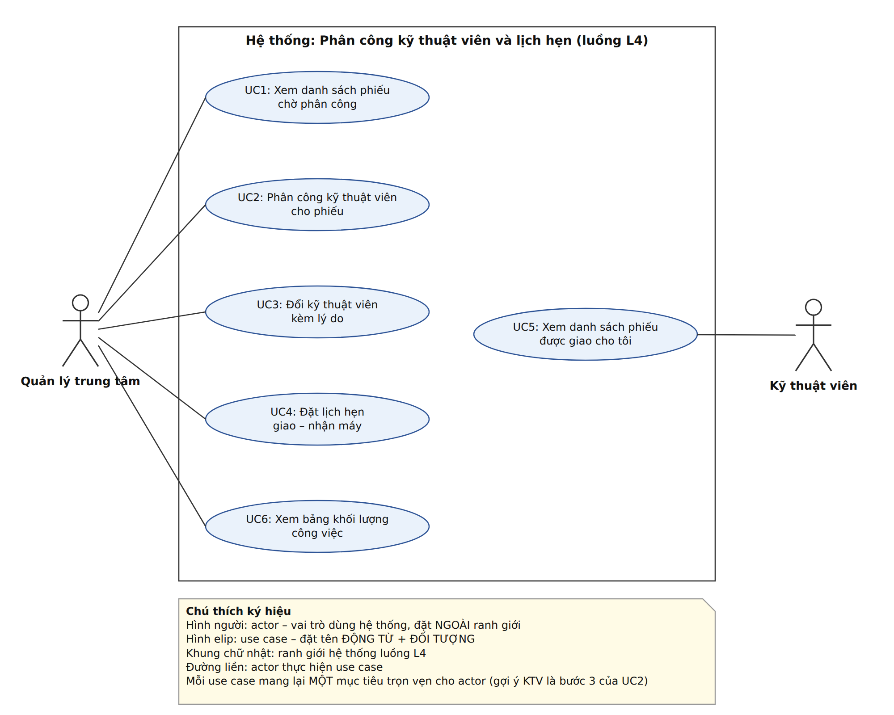

# Bản SRS rút gọn – Luồng L4: Phân công kỹ thuật viên và lịch hẹn

Nguyễn Thái Đức – MSSV 2374802010117 – Track SE · Phiên bản 1.3 (nộp BT1) · Rút gọn theo tinh thần ISO/IEC/IEEE 29148 (không tuân thủ đầy đủ)

## 1. Giới thiệu và phạm vi

**Bối cảnh.** Mekong Mobile có 6 trung tâm bảo hành, 38 kỹ thuật viên, khoảng 260 phiếu bảo hành mỗi tháng. Quản lý trung tâm hiện phân công **theo trí nhớ**, nên khối lượng lệch nhau: có người 40 phiếu/tháng, người chỉ 12 (V3). Không ai biết phiếu đang ở bước nào và khoảng 15% phiếu quá hạn cam kết mà không được cảnh báo (V2).

**Phạm vi (một câu).** Quản lý trung tâm phân công phiếu bảo hành đang ở trạng thái Mới cho kỹ thuật viên phù hợp theo tay nghề, trung tâm và khối lượng công việc, đặt lịch hẹn giao – nhận máy không trùng lịch, rồi theo dõi phiếu cho đến khi chuyển sang Hoàn tất.

**Điều CHỦ Ý KHÔNG làm (WON'T):**
W1 tiếp nhận phiếu, phân loại nhóm sự cố, sinh hạn cam kết (thuộc L2; dùng dữ liệu mẫu `tickets_history.csv`) ·
W2 kho linh kiện (L5) · W3 khảo sát hài lòng (L8) ·
W4 kỹ thuật viên cập nhật tiến độ sửa chữa Đang xử lý → Hoàn tất (thuộc quy trình sửa chữa; L4 chỉ đọc trạng thái) ·
W5 khách tự đặt lịch hẹn trực tuyến · W6 gửi SMS/Zalo nhắc lịch · W7 phân công tự động không cần người duyệt ·
W8 đăng nhập và phân quyền đầy đủ (giả lập người dùng bằng mã nhân viên) ·
W9 màn hình xem lịch sử phiếu riêng (lịch sử vẫn được GHI ở FR3, FR4; màn hình xem để giai đoạn sau) ·
W10 quản lý hủy lịch hẹn thủ công (hệ thống chỉ tự hủy lịch hẹn khi đổi kỹ thuật viên – QT-L4-05).

**Bảng thuật ngữ** (trích Bảng 3.1 case study; mỗi khái niệm chỉ dùng MỘT tên trong SRS, sơ đồ, ERD, wireframe):

| Thuật ngữ | Định nghĩa | Tên kỹ thuật |
|---|---|---|
| Phiếu bảo hành | Yêu cầu bảo hành đã ghi nhận, có mã phiếu duy nhất và vòng đời trạng thái | `ticket` |
| Trạng thái phiếu | MOI → DA_PHAN_CONG → DANG_XU_LY → CHO_LINH_KIEN → HOAN_TAT → DA_DONG; MOI/DA_PHAN_CONG → DA_HUY | `ticket.status` |
| Phiếu đang mở | Phiếu ở trạng thái DA_PHAN_CONG, DANG_XU_LY hoặc CHO_LINH_KIEN | — |
| Hạn cam kết | Thời điểm chậm nhất phải hoàn tất phiếu, sinh theo QT-04 | `ticket.due_date` |
| Phiếu sắp quá hạn / quá hạn | Phiếu chưa HOAN_TAT, còn dưới 24 giờ tới hạn cam kết / đã vượt hạn cam kết | — |
| Nhóm sự cố | MAN_HINH, PIN, SAC, PHAN_MEM, NUOC_VAO, KHAC | `issue_category` |
| Mức ưu tiên | CAO, TRUNG_BINH, THAP | `ticket.priority` |
| Kỹ thuật viên | Nhân viên sửa chữa, thuộc một trung tâm | `technician` |
| Tay nghề | Mức thành thạo 1–5 của kỹ thuật viên với một nhóm sự cố | `technician_skill.proficiency` |
| Bậc | Cấp bậc chung của kỹ thuật viên: SO_CAP, TRUNG_CAP, CAO_CAP | `technician.level` |
| Khối lượng công việc | Số phiếu đang mở mà một kỹ thuật viên đang giữ | — |
| Lịch hẹn | Khung giờ đã hẹn giữa khách và kỹ thuật viên để giao máy (GIAO_MAY) hoặc trả máy (TRA_MAY) | `appointment` |
| Lịch sử phiếu | Mỗi lần chuyển trạng thái hoặc đổi kỹ thuật viên, kèm thời điểm và người thực hiện | `ticket_status_log` |

## 2. Các bên liên quan và vai trò

| Actor | Được làm | KHÔNG được làm |
|---|---|---|
| **Quản lý trung tâm** | Xem phiếu chờ phân công; xem gợi ý; phân công và đổi kỹ thuật viên; đặt lịch hẹn; xem khối lượng công việc – chỉ trong trung tâm mình | Xem hoặc phân công phiếu của trung tâm khác (QT-14); xóa phiếu, xóa lịch hẹn (QT-13) |
| **Kỹ thuật viên** | Xem danh sách phiếu đang mở được giao cho chính mình | Tự nhận phiếu; chuyển phiếu cho người khác; xem phiếu của người khác |

Khách hàng là người hưởng lợi, không thao tác trực tiếp: quản lý đặt lịch hẹn thay khách.

## 3. Yêu cầu chức năng

| Mã | Yêu cầu chức năng (kiểm chứng được) |
|---|---|
| **FR1** | Hệ thống hiển thị danh sách phiếu trạng thái MOI của trung tâm người dùng, sắp theo hạn cam kết tăng dần, lọc được theo nhóm sự cố và mức ưu tiên, tối đa 20 phiếu/trang. |
| **FR2** | Với một phiếu, hệ thống gợi ý tối đa 3 kỹ thuật viên đang làm việc, cùng trung tâm, tay nghề ≥ 3 ở nhóm sự cố của phiếu; sắp theo khối lượng công việc tăng dần, bằng nhau thì tay nghề giảm dần. |
| **FR3** | Hệ thống cho phép phân công phiếu MOI cho đúng một kỹ thuật viên trong danh sách gợi ý; phiếu chuyển sang DA_PHAN_CONG và một dòng lịch sử phiếu được ghi kèm thời điểm, người thực hiện. |
| **FR4** | Hệ thống cho phép đổi kỹ thuật viên của phiếu đang mở với lý do bắt buộc 10–255 ký tự; lịch sử phiếu ghi kỹ thuật viên cũ, mới, lý do, thời điểm, người đổi. |
| **FR5** | Hệ thống cho phép tạo lịch hẹn GIAO_MAY hoặc TRA_MAY cho phiếu đã có kỹ thuật viên và từ chối lịch hẹn giao nhau với lịch hẹn DA_HEN khác của cùng kỹ thuật viên. |
| **FR6** | Hệ thống hiển thị cho kỹ thuật viên các phiếu đang mở được giao cho họ, sắp theo hạn cam kết, đánh dấu phiếu sắp quá hạn và quá hạn. |
| **FR7** | Hệ thống hiển thị bảng khối lượng công việc của trung tâm: mỗi kỹ thuật viên có số phiếu đang mở, số phiếu sắp quá hạn, số phiếu quá hạn tại thời điểm xem. |

| Mã | User Story | MoSCoW |
|---|---|---|
| **US1** | Là **quản lý trung tâm**, tôi muốn xem danh sách phiếu chưa phân công sắp theo hạn cam kết để phân công phiếu gấp trước. | MUST |
| **US2** | Là **quản lý trung tâm**, tôi muốn xem gợi ý kỹ thuật viên phù hợp với nhóm sự cố của phiếu để không giao sai người phải chuyển qua chuyển lại. | MUST |
| **US3** | Là **quản lý trung tâm**, tôi muốn phân công một phiếu cho một kỹ thuật viên để biết chắc ai đang giữ phiếu từ lúc nào. | MUST |
| **US4** | Là **quản lý trung tâm**, tôi muốn đổi kỹ thuật viên của phiếu kèm lý do để việc chuyển giao có vết, không mất trách nhiệm. | SHOULD |
| **US5** | Là **quản lý trung tâm**, tôi muốn đặt lịch hẹn giao – nhận máy không trùng với lịch hẹn khác của kỹ thuật viên để không phải gọi hẹn lại khách. | SHOULD |
| **US6** | Là **kỹ thuật viên**, tôi muốn xem danh sách phiếu được giao cho tôi sắp theo hạn cam kết để ưu tiên xử lý phiếu sắp quá hạn trước. | SHOULD |
| **US7** | Là **quản lý trung tâm**, tôi muốn xem số phiếu đang giữ và số phiếu quá hạn của từng kỹ thuật viên để chia việc đều và không phải đếm tay cuối tháng. | SHOULD |

**Lý do xếp mức:** 3 story MUST (US1, US2, US3) tạo thành luồng tối thiểu *thấy phiếu → được gợi ý → phân công*; thiếu một story thì L4 không chạy được. US5 để SHOULD vì có cách làm tạm (quản lý gọi điện hẹn khách như hiện nay – Mục 6.1 bước 11). Story xem lịch sử phiếu và hủy lịch hẹn thủ công (mức COULD ở Buổi 4) chuyển thành W9, W10 để giữ đúng 5–7 User Story theo yêu cầu BT1.

**Tiêu chí chấp nhận (Given – When – Then)** cho 3 story MUST, kèm US5 vì có quy tắc chặn trùng lịch cần kiểm thử. Tổng 10 tiêu chí, trong đó 6 tiêu chí *(ngoại lệ)*; mỗi story MUST có ít nhất 1 tiêu chí ngoại lệ:
- **US1** – AC1: GIVEN trung tâm Tân Bình có 3 phiếu MOI hạn 10:00, 08:00, 15:00, WHEN chị Trâm (quản lý) mở danh sách, THEN thứ tự hiển thị là 08:00, 10:00, 15:00. AC2 *(ngoại lệ)*: GIVEN có phiếu MOI của trung tâm Quận 10, WHEN quản lý trung tâm Tân Bình mở danh sách, THEN phiếu đó không xuất hiện (QT-14).
- **US2** – AC1: GIVEN phiếu MAN_HINH, KTV A (tay nghề 4, 2 phiếu mở), B (5, 2), C (3, 5), D (2, 0), WHEN xem gợi ý, THEN thứ tự B, A, C, không có D. AC2 *(ngoại lệ)*: GIVEN không ai thỏa điều kiện, WHEN xem gợi ý, THEN danh sách rỗng kèm thông báo "Không có kỹ thuật viên đủ tay nghề tại trung tâm".
- **US3** – AC1: GIVEN phiếu MOI và KTV A trong danh sách gợi ý, WHEN xác nhận phân công, THEN phiếu chuyển DA_PHAN_CONG, có 1 dòng lịch sử MOI → DA_PHAN_CONG. AC2 *(ngoại lệ)*: GIVEN phiếu đã DA_PHAN_CONG, WHEN phân công lần nữa, THEN bị từ chối. AC3 *(ngoại lệ)*: GIVEN KTV không thỏa QT-08, WHEN phân công, THEN bị từ chối, phiếu giữ MOI.
- **US5** – AC1 *(ngoại lệ)*: GIVEN KTV A có lịch hẹn 09:00–09:30, WHEN tạo lịch hẹn 09:15–09:45, THEN bị từ chối và hiển thị lịch hẹn trùng. AC2: GIVEN khung 10:00–10:30 trống, WHEN tạo lịch hẹn TRA_MAY, THEN lưu ở trạng thái DA_HEN. AC3 *(ngoại lệ)*: GIVEN phiếu MOI chưa có KTV, WHEN tạo lịch hẹn, THEN bị từ chối.

## 4. Yêu cầu phi chức năng

| Mã | Loại | Yêu cầu và ngưỡng đo được | Cách kiểm chứng |
|---|---|---|---|
| **NFR1** | Hiệu năng | Danh sách phiếu (FR1, FR6) trả về dưới **2 giây** khi có **10.000 phiếu**, máy 8 GB RAM | Nạp 10.000 phiếu mô phỏng (seed 42), đo trung bình 20 lần gọi |
| **NFR2** | Hiệu năng | Gợi ý kỹ thuật viên (FR2) trả về dưới **1 giây** với 38 kỹ thuật viên và 10.000 phiếu | Như NFR1 |
| **NFR3** | Tin cậy | Phân công và ghi lịch sử phiếu cùng thành công hoặc cùng không xảy ra; với **2 yêu cầu phân công đồng thời** cho một phiếu, **đúng 1** thành công | Gửi 2 request song song; phiếu có đúng 1 KTV và 1 dòng lịch sử |
| **NFR4** | Bảo mật | **100%** chức năng kiểm tra vai trò và trung tâm trước khi trả dữ liệu (QT-14) | Gọi từng chức năng bằng vai trò/trung tâm không được phép → bị từ chối |
| **NFR5** | Khả dụng | Quản lý phân công một phiếu từ danh sách đến xác nhận trong **≤ 3 lần bấm** và **dưới 30 giây** | Đếm thao tác trên wireframe; bấm giờ 5 lần thử |

## 5. Ràng buộc và quy tắc nghiệp vụ

| Mã | Quy tắc | Nguồn |
|---|---|---|
| QT-04 | Hạn cam kết sinh theo mức ưu tiên (CAO 24h, TRUNG_BINH 72h, THAP 120h, thứ Hai–thứ Bảy). L4 **chỉ đọc**. | Bảng 9.1 |
| QT-06 | Chỉ chuyển trạng thái theo vòng đời Hình 6.2, không quay lại; mọi lần chuyển ghi vào lịch sử phiếu. | Bảng 9.1 |
| QT-07 | Mỗi phiếu tối đa một kỹ thuật viên; đổi kỹ thuật viên phải ghi lý do. | Bảng 9.1 |
| QT-08 | Chỉ phân công cho kỹ thuật viên cùng trung tâm, tay nghề ≥ 3 ở nhóm sự cố của phiếu. | Bảng 9.1 |
| QT-13 | Không xóa vật lý phiếu và lịch hẹn; chỉ đánh dấu, giữ lịch sử. | Bảng 9.1 |
| QT-14 | Nhân viên chỉ xem dữ liệu trung tâm mình. | Bảng 9.1 |
| QT-L4-01 | Chỉ phân công phiếu MOI; chỉ đổi kỹ thuật viên khi phiếu đang mở. | Phân tích từ QT-06, QT-07 |
| QT-L4-02 | Hai lịch hẹn DA_HEN của cùng kỹ thuật viên không giao nhau về thời gian. | Phát biểu anh Dũng (Mục 4) |
| QT-L4-03 | Lịch hẹn dài 15–120 phút, trong 08:00–18:00, thứ Hai–thứ Bảy, bắt đầu sau hiện tại. *Giờ làm việc là giả định, chờ giảng viên xác nhận.* | Phân tích từ QT-04 |
| QT-L4-04 | Lịch hẹn chỉ tạo cho phiếu đã có kỹ thuật viên và gắn với kỹ thuật viên đang giữ phiếu. | Định nghĩa "Lịch hẹn" |
| QT-L4-05 | Khi đổi kỹ thuật viên, lịch hẹn DA_HEN chưa diễn ra của phiếu bị hủy và phải đặt lại. | Hệ quả QT-L4-04 |

## 6. Bảng truy vết yêu cầu

| Mã FR | Yêu cầu (tóm tắt) | User Story | Use Case | MoSCoW | Bảng dữ liệu | Màn hình |
|---|---|---|---|---|---|---|
| FR1 | Danh sách phiếu MOI theo hạn cam kết | US1 | UC1 | MUST | ticket, issue_category | M1 Danh sách phiếu |
| FR2 | Gợi ý tối đa 3 kỹ thuật viên theo QT-08 | US2 | UC2 | MUST | technician, technician_skill, ticket | M2 Phân công |
| FR3 | Phân công phiếu MOI, ghi lịch sử phiếu | US3 | UC2 | MUST | ticket, ticket_status_log | M2 Phân công |
| FR4 | Đổi kỹ thuật viên kèm lý do | US4 | UC3 | SHOULD | ticket, ticket_status_log | M2 (ô lý do đổi) |
| FR5 | Tạo lịch hẹn, chặn trùng lịch | US5 | UC4 | SHOULD | appointment | M3 Đặt lịch hẹn |
| FR6 | Danh sách phiếu của kỹ thuật viên | US6 | UC5 | SHOULD | ticket | M1 (cùng bố cục bảng) |
| FR7 | Bảng khối lượng công việc | US7 | UC6 | SHOULD | ticket, technician | M1 (cùng bố cục bảng) |
| — | Xem lịch sử phiếu riêng (W9), hủy lịch hẹn thủ công (W10), gửi SMS (W6) | — | — | WON'T | — | ngoài phạm vi |

**Đọc theo hàng:** mỗi FR mức MUST/SHOULD đủ User Story, use case, bảng dữ liệu và màn hình; chỉ hàng WON'T được trống. **Đọc theo cột "Bảng dữ liệu":** cả 6 bảng của ERD (`ticket`, `issue_category`, `technician`, `technician_skill`, `ticket_status_log`, `appointment`) đều xuất hiện ít nhất một lần, không có bảng cô lập. Mã test case dự kiến TC01–TC14 ứng với các tiêu chí chấp nhận ở mục 3, viết chi tiết ở BT3.

**Thay đổi khi nộp BT1 (Buổi 6):** rút từ 9 xuống 7 User Story theo yêu cầu "5–7 User Story" của BT1 – hai story mức COULD (xem lịch sử phiếu, hủy lịch hẹn thủ công) chuyển thành W9, W10; sơ đồ còn 6 use case mạnh; bảng truy vết bổ sung cột Bảng dữ liệu và Màn hình.

**Thay đổi so với bản nháp Buổi 3:** giữ 8 User Story với 3 story MUST theo checklist Buổi 4 (US5 hạ xuống SHOULD, thêm US8 mức COULD); story "kỹ thuật viên cập nhật tiến độ sửa chữa" chuyển thành W4 để phạm vi chỉ còn một luồng phân công và lịch hẹn; lịch sử đổi kỹ thuật viên ghi chung vào `ticket_status_log`; gắn nhãn *(ngoại lệ)* cho các tiêu chí chấp nhận ngoại lệ; bỏ use case "Xem gợi ý kỹ thuật viên" vì là use case yếu (chỉ là bước 3 của UC2, xem xong quản lý chưa đạt mục tiêu), đánh số lại UC1–UC6.

---

# Use Case

## Use Case Diagram

File gốc: [`usecase.drawio`](usecase.drawio).

## UC2 – Phân công kỹ thuật viên cho phiếu

| | |
|---|---|
| **Actor chính** | Quản lý trung tâm |
| **Mục tiêu** | Giao một phiếu MOI cho đúng một kỹ thuật viên phù hợp để phiếu được xử lý trước hạn cam kết |
| **Điều kiện trước** | Người dùng có vai trò quản lý; phiếu thuộc trung tâm của họ, trạng thái MOI, đã có nhóm sự cố |
| **Điều kiện sau** | Phiếu ở DA_PHAN_CONG, có đúng 1 kỹ thuật viên; có 1 dòng lịch sử phiếu mới |
| **Liên quan** | US2, US3 · FR2, FR3 · QT-06, QT-07, QT-08 · MUST |

**Luồng chính**
1. Quản lý chọn "Phân công" ở một phiếu trong danh sách phiếu chờ phân công (UC1).
2. Hệ thống hiển thị mã phiếu, nhóm sự cố, mức ưu tiên, hạn cam kết, mô tả lỗi.
3. Hệ thống hiển thị tối đa 3 kỹ thuật viên gợi ý kèm tay nghề và khối lượng công việc (FR2 – US2; đây là một bước của use case này, không tách thành use case riêng vì xem gợi ý xong quản lý chưa đạt mục tiêu).
4. Quản lý chọn một kỹ thuật viên và bấm "Phân công".
5. Hệ thống kiểm tra lại: phiếu vẫn MOI, kỹ thuật viên vẫn thỏa QT-08.
6. Hệ thống gán kỹ thuật viên, chuyển phiếu sang DA_PHAN_CONG và ghi lịch sử phiếu trong cùng một giao dịch.
7. Hệ thống báo thành công và gợi ý đặt lịch hẹn (UC4).

**Luồng ngoại lệ**
- **3a.** Không có kỹ thuật viên nào thỏa điều kiện → hiển thị "Không có kỹ thuật viên đủ tay nghề tại trung tâm"; phiếu giữ MOI; quản lý xử lý ngoài hệ thống. Kết thúc.
- **5a.** Phiếu vừa được người khác phân công → từ chối, hiển thị kỹ thuật viên đã được gán, không ghi đè. Quay lại bước 1.
- **5b.** Kỹ thuật viên không còn thỏa QT-08 (vừa nghỉ việc, bị chỉnh tay nghề) → từ chối, tải lại gợi ý. Quay lại bước 3.
- **6a.** Lỗi kết nối cơ sở dữ liệu khi lưu → hủy toàn bộ giao dịch, phiếu vẫn MOI, cho phép thử lại, không sinh lịch sử trùng.

## UC4 – Đặt lịch hẹn giao – nhận máy

| | |
|---|---|
| **Actor chính** | Quản lý trung tâm |
| **Mục tiêu** | Hẹn khách một khung giờ giao máy hoặc trả máy mà kỹ thuật viên chắc chắn rảnh |
| **Điều kiện trước** | Phiếu thuộc trung tâm của quản lý, là phiếu đang mở và đã có kỹ thuật viên |
| **Điều kiện sau** | Một lịch hẹn DA_HEN được lưu, không giao nhau với lịch hẹn khác của kỹ thuật viên |
| **Liên quan** | US5 · FR5 · QT-L4-02, QT-L4-03, QT-L4-04 · SHOULD |

**Luồng chính**
1. Quản lý mở phiếu và chọn "Đặt lịch hẹn".
2. Hệ thống hiển thị các lịch hẹn sắp tới của kỹ thuật viên đang giữ phiếu.
3. Quản lý chọn loại lịch hẹn (GIAO_MAY / TRA_MAY), ngày, giờ bắt đầu, giờ kết thúc, ghi chú.
4. Hệ thống kiểm tra khung giờ theo QT-L4-03.
5. Hệ thống kiểm tra khung giờ không giao nhau với lịch hẹn DA_HEN nào của kỹ thuật viên (QT-L4-02).
6. Hệ thống lưu lịch hẹn ở trạng thái DA_HEN và hiển thị thông tin để quản lý báo khách.

**Luồng ngoại lệ**
- **1a.** Phiếu chưa có kỹ thuật viên → từ chối, hiển thị "Phiếu chưa được phân công", chuyển tới UC2.
- **4a.** Khung giờ không hợp lệ (quá khứ, ngoài 08:00–18:00, Chủ nhật, dưới 15 hoặc trên 120 phút) → từ chối, nêu rõ điều kiện vi phạm, giữ dữ liệu đã nhập. Quay lại bước 3.
- **5a.** Trùng lịch kỹ thuật viên → từ chối, hiển thị lịch hẹn bị trùng và khung giờ trống gần nhất cùng ngày. Quay lại bước 3.
