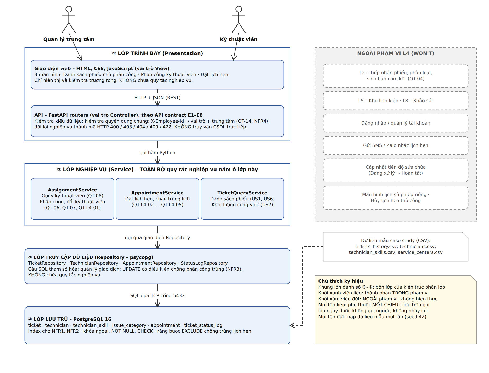
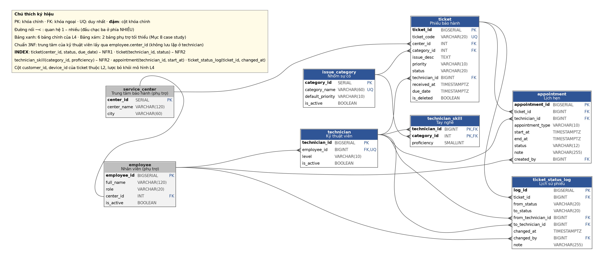
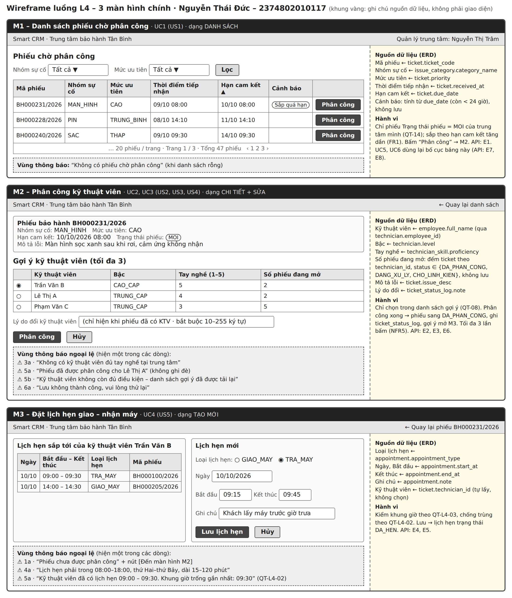

# Thiết kế kiến trúc

File gốc: [`architecture.drawio`](architecture.drawio). Kiến trúc chọn: **kiến trúc phân lớp (Layered) 4 lớp** làm khung tổng thể, **MVC** bên trong lớp trình bày (giao diện web là View, FastAPI routers là Controller), **Repository** cho lớp truy cập dữ liệu. Ứng dụng chạy một tiến trình trên máy cá nhân.

| Lớp | Thành phần | Trách nhiệm | KHÔNG được làm | Trao đổi |
|---|---|---|---|---|
| ① Trình bày | Giao diện web (View) · FastAPI routers (Controller) | Hiển thị 3 màn hình; nhận request theo API contract E1–E8; kiểm tra kiểu dữ liệu; kiểm tra quyền dùng chung (vai trò + trung tâm); đổi lỗi nghiệp vụ thành mã HTTP | Chứa quy tắc nghiệp vụ; truy vấn CSDL trực tiếp | Giao diện → API: HTTP + JSON (REST). API → Service: gọi hàm Python |
| ② Nghiệp vụ | AssignmentService · AppointmentService · TicketQueryService | Chứa **toàn bộ** quy tắc: QT-06, QT-07, QT-08, QT-L4-01 … QT-L4-05 | Biết dữ liệu lưu bằng công nghệ gì; biết về HTTP | Gọi qua giao diện Repository |
| ③ Truy cập dữ liệu | TicketRepository · TechnicianRepository · AppointmentRepository · StatusLogRepository | Câu SQL tham số hóa; mở/đóng giao dịch; UPDATE có điều kiện | Chứa quy tắc nghiệp vụ; gọi ngược lên Service | SQL qua TCP cổng 5432 |
| ④ Lưu trữ | PostgreSQL 16 | Lưu 6 bảng; bảo đảm toàn vẹn bằng khóa ngoại, NOT NULL, CHECK, EXCLUDE; index | — | Chỉ nhận kết nối từ lớp ③ |

**Phụ thuộc một chiều:** lớp trên chỉ gọi lớp ngay dưới, lớp dưới không bao giờ gọi lớp trên, không nhảy cóc. **Ngoài phạm vi** (khối xám): L2 tiếp nhận, L5 kho linh kiện, L8 khảo sát, đăng nhập, SMS/Zalo, cập nhật tiến độ sửa chữa – nối với mục WON'T của SRS.

**Ví dụ một yêu cầu đi qua bốn lớp – "Phân công kỹ thuật viên" (UC2):** màn hình gửi `POST /api/tickets/88231/assignment {technician_id: 12}` → Controller kiểm tra kiểu và quyền → `AssignmentService.assign()` kiểm tra phiếu còn MOI và kỹ thuật viên thỏa QT-08 → `TicketRepository` chạy `UPDATE ticket ... WHERE status = 'MOI'` và `StatusLogRepository` ghi lịch sử trong cùng giao dịch → PostgreSQL. Thành công: trả 201 lên màn hình. Ngoại lệ 5a (phiếu đã được phân công): UPDATE không đổi dòng nào → Service ném lỗi → Controller trả 409 → màn hình hiện thông báo đã vẽ trên wireframe.

**Lập luận lựa chọn kiến trúc** (khuôn: *Vì NFR… yêu cầu…, tôi chọn…, đánh đổi là…*)

1. Vì **NFR3** yêu cầu phân công và ghi lịch sử phiếu cùng thành công hoặc cùng không xảy ra, và khi có 2 yêu cầu đồng thời thì **đúng 1** thành công, tôi chọn **một cơ sở dữ liệu quan hệ PostgreSQL duy nhất, giao dịch do lớp Truy cập dữ liệu quản lý, và câu `UPDATE ... WHERE status = 'MOI'` có điều kiện**, đánh đổi là mọi chức năng dùng chung một CSDL nên không tách triển khai riêng được, và tôi phải tự viết SQL thay vì dùng ORM cho nhanh.
2. Vì **NFR4** yêu cầu **100%** chức năng kiểm tra vai trò và trung tâm, tôi chọn **đặt việc kiểm tra quyền ở một thành phần dùng chung của lớp trình bày (API), chạy trước mọi endpoint**, thay vì để từng hàm tự kiểm tra, đánh đổi là mỗi request tốn thêm một truy vấn tra bảng `employee` và lớp trình bày phụ thuộc vào bảng này.
3. Vì **NFR1** và **NFR2** yêu cầu danh sách phiếu **dưới 2 giây** và gợi ý **dưới 1 giây** với **10.000 phiếu**, tôi chọn **để CSDL lọc, đếm, sắp xếp và phân trang bằng truy vấn có index `(center_id, status, due_date)` và `(technician_id, status)`**, thay vì tải toàn bộ phiếu lên lớp Nghiệp vụ rồi xử lý bằng Python, đánh đổi là một phần quy tắc gợi ý QT-08 nằm trong câu SQL nên khó kiểm thử đơn vị hơn, và mỗi index làm thao tác ghi chậm thêm một chút – chấp nhận được vì đọc nhiều hơn ghi.
4. Vì **NFR1** yêu cầu **dưới 2 giây trên máy 8 GB RAM** và dự án chỉ có một người làm trong 6 buổi, tôi chọn **kiến trúc phân lớp chạy một tiến trình** thay vì tách microservices, đánh đổi là khi các luồng khác (L2, L5) nhập vào sẽ dùng chung một mã nguồn và không mở rộng từng phần độc lập được.

# Mô hình dữ liệu (Track SE – ERD chuẩn 3NF)

File gốc: [`schema.dbml`](schema.dbml) (dbdiagram.io) · SQL DDL: [`schema.sql`](schema.sql) (đã kiểm tra cú pháp bằng bộ phân tích cú pháp PostgreSQL).

**Bốn bước đi từ SRS tới mô hình dữ liệu**

| Bước | Kết quả áp dụng cho L4 |
|---|---|
| 1. Gạch chân DANH TỪ → thực thể | phiếu bảo hành → `ticket` · kỹ thuật viên → `technician` · tay nghề → `technician_skill` · nhóm sự cố → `issue_category` · lịch hẹn → `appointment` · lịch sử phiếu → `ticket_status_log` |
| 2. Hỏi "cần biết gì?" → thuộc tính | Lấy từ mục 5 SRS (quy tắc) và wireframe: `priority`, `status`, `due_date`, `proficiency`, `start_at`, `end_at`, `note`… |
| 3. Đọc ĐỘNG TỪ → quan hệ | quản lý **GÁN** phiếu cho kỹ thuật viên (1:N, `ticket.technician_id` cho phép NULL) · kỹ thuật viên **CÓ** tay nghề ở nhiều nhóm sự cố (N:M → bảng trung gian `technician_skill`) · phiếu **CÓ** nhiều lịch hẹn (1:N) · hệ thống **LƯU** lịch sử phiếu (1:N) |
| 4. Truy vết ngược bảng → FR | Bảng dưới đây: bảng nào cũng phục vụ ít nhất một FR, FR nào cũng có bảng đỡ |

| Bảng | Vai trò | Khóa chính | Khóa ngoại | Phục vụ FR |
|---|---|---|---|---|
| `issue_category` | Nhóm sự cố, để khớp tay nghề | `category_id` | — (được tham chiếu) | FR1, FR2 |
| `technician` | Kỹ thuật viên, bậc | `technician_id` | `employee_id` | FR2, FR3, FR4, FR6, FR7 |
| `technician_skill` | Tay nghề 1–5 theo nhóm sự cố (QT-08) | `(technician_id, category_id)` | `technician_id`, `category_id` | FR2 |
| `ticket` | Phiếu bảo hành, trạng thái, kỹ thuật viên đang giữ | `ticket_id` | `center_id`, `category_id`, `technician_id` | FR1, FR3, FR4, FR6, FR7 |
| `appointment` | Lịch hẹn giao – nhận máy | `appointment_id` | `ticket_id`, `technician_id`, `created_by` | FR5 |
| `ticket_status_log` | Lịch sử phiếu: chuyển trạng thái, đổi kỹ thuật viên | `log_id` | `ticket_id`, `from_technician_id`, `to_technician_id`, `changed_by` | FR3, FR4 |

**Kiểm chứng track SE:** 6 bảng chính ✔ · mỗi bảng có khóa chính ✔ · 14 quan hệ khóa ngoại ✔ · không bảng cô lập ✔ · có SQL DDL skeleton ✔. Hai bảng phụ trợ tối thiểu `service_center`, `employee` được case study cho phép tự thiết kế (Mục 8), chỉ giữ cột cần cho L4.

**Soi năm lỗi mô hình dữ liệu (Buổi 5)**

| Lỗi | Kết quả kiểm tra |
|---|---|
| 1. Bảng cô lập | ✔ Không có: cả 8 bảng đều nối với ít nhất một bảng khác bằng khóa ngoại |
| 2. Thiếu bảng lịch sử | ✔ Có `ticket_status_log` ghi mỗi lần chuyển trạng thái và đổi kỹ thuật viên, kèm thời điểm, người thực hiện |
| 3. Lưu giá trị tính được | ✔ Không lưu "số phiếu đang mở", "sắp quá hạn": tính khi truy vấn từ `ticket.status`, `due_date` |
| 4. Không có index | ✔ 5 index gắn với NFR1, NFR2 (bảng index bên dưới, ghi cả trên ERD) |
| 5. Khóa nghiệp vụ làm khóa chính | ✔ Dùng khóa nhân tạo `ticket_id`; mã phiếu `ticket_code` chỉ đặt UNIQUE; `category_name` cũng chỉ UNIQUE |

**Kiểm tra chuẩn hóa 3NF** – câu hỏi nhanh: *"biết khóa chính thì có biết ngay giá trị cột này không, mà không cần đi qua cột khác?"*

| Dạng chuẩn | Kiểm tra | Kết quả |
|---|---|---|
| 1NF | Mỗi ô một giá trị, không nhóm lặp | ✔ Tay nghề theo nhiều nhóm sự cố tách thành bảng `technician_skill`, không lưu chuỗi "MAN_HINH, PIN" |
| 2NF | Bảng khóa ghép `technician_skill (technician_id, category_id)`: cột không khóa phụ thuộc toàn bộ khóa | ✔ `proficiency` phụ thuộc cả kỹ thuật viên lẫn nhóm sự cố |
| 3NF | Không phụ thuộc bắc cầu | ✔ **Đã sửa:** bản nháp có cả `technician.center_id` và `employee.center_id` (trung tâm phụ thuộc bắc cầu qua `employee_id`) → bỏ `technician.center_id`, lấy trung tâm qua phép nối với `employee`. `ticket` không lưu tên kỹ thuật viên hay tên nhóm sự cố, chỉ lưu khóa ngoại |

`appointment.technician_id` **không** phải dư thừa: nó ghi kỹ thuật viên **tại thời điểm hẹn** (không đổi khi phiếu đổi người – QT-L4-05 hủy lịch cũ) và cần cho ràng buộc EXCLUDE chống trùng lịch.

**Index gắn với yêu cầu phi chức năng**

| Index | Phục vụ | NFR |
|---|---|---|
| `ticket (center_id, status, due_date)` | E1 – danh sách phiếu MOI sắp theo hạn cam kết | NFR1 |
| `ticket (technician_id, status)` | E2, E7, E8 – đếm phiếu đang mở của kỹ thuật viên | NFR1, NFR2 |
| `technician_skill (category_id, proficiency)` | E2 – lọc kỹ thuật viên tay nghề ≥ 3 | NFR2 |
| `appointment (technician_id, start_at)` + EXCLUDE | E4, E5 – lịch hẹn và chống trùng (QT-L4-02) | NFR3 |
| `ticket_status_log (ticket_id, changed_at)` | E6 – đọc dòng lịch sử gần nhất khi đổi kỹ thuật viên; kiểm chứng NFR3 (đúng 1 dòng lịch sử) | NFR3 |

**Điều chỉnh so với từ điển dữ liệu tham chiếu (Mục 8 case study), có lý do:**
- `ticket_status_log` thêm `from_technician_id`, `to_technician_id` để ghi việc đổi kỹ thuật viên kèm lý do (QT-07) mà không cần thêm bảng thứ 7.
- `technician` bỏ `center_id` để đạt 3NF (trung tâm lấy qua `employee`).
- `ticket` lược bỏ `customer_id`, `device_id`, `is_warranty` (thuộc L2, L4 không dùng); thêm `is_deleted` cho QT-13.
- `appointment` do em thiết kế (case study chỉ nêu tên): `EXCLUDE` chặn trùng lịch ở mức CSDL (QT-L4-02), `CHECK` độ dài 15–120 phút (QT-L4-03).
- Dùng `TIMESTAMPTZ` thay `TIMESTAMP` để lưu múi giờ +07:00 đúng quy ước ISO 8601 của API contract.

# Wireframe 3 màn hình

**Đối chiếu từng trường trên màn hình với mô hình dữ liệu**

| Màn hình | Dạng | Use case | Trường hiển thị → cột trong ERD |
|---|---|---|---|
| M1 Danh sách phiếu chờ phân công | Danh sách | UC1 (UC5, UC6 dùng lại bố cục) | Mã phiếu `ticket.ticket_code` · Nhóm sự cố `issue_category.category_name` · Mức ưu tiên `ticket.priority` · Thời điểm tiếp nhận `ticket.received_at` · Hạn cam kết `ticket.due_date` · Cảnh báo (tính từ `due_date`, không lưu) |
| M2 Phân công kỹ thuật viên | Chi tiết + sửa | UC2, UC3 | Trạng thái phiếu `ticket.status` · Mô tả lỗi `ticket.issue_desc` · Kỹ thuật viên `employee.full_name` · Bậc `technician.level` · Tay nghề `technician_skill.proficiency` · Số phiếu đang mở (đếm `ticket`) · Lý do đổi `ticket_status_log.note` |
| M3 Đặt lịch hẹn giao – nhận máy | Tạo mới | UC4 | Loại lịch hẹn `appointment.appointment_type` · Bắt đầu `appointment.start_at` · Kết thúc `appointment.end_at` · Ghi chú `appointment.note` · Kỹ thuật viên lấy từ `ticket.technician_id` |

**Kiểm hai chiều:** mọi trường trên màn hình có cột tương ứng; ngược lại mọi cột NOT NULL được nhập trên màn hình hoặc do hệ thống tự sinh (`ticket_status_log.changed_at`, `changed_by`, `appointment.status`, `created_by`). Cả 6 bảng chính đều xuất hiện ở ít nhất một màn hình.

**Mỗi luồng ngoại lệ có chỗ hiển thị trên wireframe**

| Ngoại lệ đã đặc tả | Thông báo trên wireframe | Màn hình |
|---|---|---|
| UC2 – 3a Không có kỹ thuật viên đủ điều kiện | "Không có kỹ thuật viên đủ tay nghề tại trung tâm" | M2 |
| UC2 – 5a Phiếu vừa được người khác phân công | "Phiếu đã được phân công cho …" | M2 |
| UC2 – 5b Kỹ thuật viên không còn thỏa QT-08 | "Kỹ thuật viên không còn đủ điều kiện – danh sách gợi ý đã được tải lại" | M2 |
| UC2 – 6a Lỗi lưu dữ liệu | "Lưu không thành công, vui lòng thử lại" | M2 |
| UC4 – 1a Phiếu chưa có kỹ thuật viên | "Phiếu chưa được phân công" + nút đến M2 | M3 |
| UC4 – 4a Khung giờ không hợp lệ | "Lịch hẹn phải trong 08:00–18:00, thứ Hai–thứ Bảy, dài 15–120 phút" | M3 |
| UC4 – 5a Trùng lịch kỹ thuật viên | "Kỹ thuật viên đã có lịch hẹn … Khung giờ trống gần nhất …" | M3 |

# Kiểm tra tính nhất quán thuật ngữ

**Phép 1 – Bảng thuật ngữ.** Mỗi khái niệm chỉ có **một tên** trong mọi tài liệu và sơ đồ. Bảng dưới đối chiếu từng thuật ngữ của mục 1 SRS với Use Case, sơ đồ kiến trúc, ERD, wireframe và API contract.

| Thuật ngữ (SRS mục 1) | Use Case | Kiến trúc | ERD | Wireframe | API contract |
|---|---|---|---|---|---|
| Phiếu bảo hành | "phiếu" (UC1, UC2, UC5) | TicketQueryService, TicketRepository | `ticket` | "Phiếu bảo hành BH000231/2026", "Mã phiếu" | `ticket_id`, `ticket_code` |
| Trạng thái phiếu | điều kiện trước/sau UC2 | — | `ticket.status` | "Trạng thái phiếu: MOI" | `status` |
| Hạn cam kết | UC1 | index (center_id, status, due_date) | `ticket.due_date` | "Hạn cam kết ▲" | `due_date` |
| Nhóm sự cố | UC2 bước 2 | — | `issue_category` | "Nhóm sự cố" | `category_name` |
| Mức ưu tiên | UC2 bước 2 | — | `ticket.priority` | "Mức ưu tiên" | `priority` |
| Kỹ thuật viên | actor "Kỹ thuật viên", UC2, UC3 | TechnicianRepository | `technician` | "Kỹ thuật viên", "Gợi ý kỹ thuật viên" | `technician_id` |
| Tay nghề | UC2 bước 3 | AssignmentService (QT-08) | `technician_skill.proficiency` | "Tay nghề (1–5)" | `proficiency` |
| Bậc | — | — | `technician.level` | "Bậc" | `level` |
| Khối lượng công việc / phiếu đang mở | UC6 | TicketQueryService | đếm `ticket` theo `status` | "Số phiếu đang mở" | `open_ticket_count` |
| Lịch hẹn | UC4 | AppointmentService, AppointmentRepository | `appointment` | "Lịch hẹn mới", "Loại lịch hẹn" | `appointment_id`, `appointment_type` |
| Lịch sử phiếu | điều kiện sau UC2, UC3 | StatusLogRepository | `ticket_status_log` | "Lý do đổi kỹ thuật viên" (ghi vào lịch sử phiếu) | `status_log` |
| Quản lý trung tâm | actor "Quản lý trung tâm" | kiểm tra quyền (vai trò) | `employee.role = QUAN_LY` | "Quản lý trung tâm: Nguyễn Thị Trâm" | header `X-Employee-Id` |
| Trung tâm bảo hành | "trung tâm mình" (QT-14) | kiểm tra quyền (trung tâm) | `service_center` | "Trung tâm bảo hành Tân Bình" | `center_name` |

**Kết quả:** 13/13 thuật ngữ dùng **một tên duy nhất** trên cả 6 tài liệu.

**Sáu phép kiểm nhất quán (Buổi 6)**

| Phép kiểm | Kết quả trên hồ sơ |
|---|---|
| 1. Bảng thuật ngữ | ✔ Có ở mục 1 SRS; 13 thuật ngữ khớp trên SRS, Use Case, kiến trúc, ERD, wireframe, API (bảng trên) |
| 2. Truy vết đầy đủ | ✔ Bảng mục 6 SRS: 7 FR mức MUST/SHOULD đủ User Story, use case, bảng dữ liệu, màn hình; chỉ hàng WON'T để trống |
| 3. Kiến trúc ↔ dữ liệu | ✔ Lớp lưu trữ trên sơ đồ kiến trúc ghi đúng 6 bảng: `ticket`, `technician`, `technician_skill`, `issue_category`, `appointment`, `ticket_status_log` – trùng ERD |
| 4. Wireframe ↔ dữ liệu | ✔ Mọi trường trên M1–M3 có cột trong ERD; cả 6 bảng xuất hiện ở ít nhất một màn hình (bảng đối chiếu ở mục 5) |
| 5. Lập luận ↔ yêu cầu | ✔ 4 câu lập luận đều có mã NFR (NFR1–NFR4), ngưỡng số, quyết định và đánh đổi |
| 6. Ngoại lệ ↔ giao diện | ✔ 7/7 luồng ngoại lệ của UC2, UC4 có vùng thông báo trên M2, M3 (bảng ở mục 5) |

**Mười một mục kiểm chứng của Bài tập 1**

| # | Mục kiểm chứng | Đạt | Minh chứng |
|---|---|---|---|
| 1 | Đủ 5 đầu mục: SRS, Use Case, kiến trúc, mô hình dữ liệu, wireframe | ✔ | Mục 1 – 5 |
| 2 | SRS đủ 6 mục; ≥ 4 FR có mã; ≥ 3 NFR có ngưỡng số | ✔ | 7 FR, 5 NFR |
| 3 | 5–7 User Story chuẩn INVEST, có MoSCoW | ✔ | 7 story, 3 MUST |
| 4 | Mỗi FR truy vết tới ≥ 1 User Story | ✔ | Bảng truy vết mục 6 SRS |
| 5 | Use Case Diagram ≥ 1 actor, ≥ 5 use case, ranh giới, chú thích | ✔ | 2 actor, 6 use case mạnh |
| 6 | Đặc tả use case quan trọng nhất: luồng chính + ≥ 1 ngoại lệ | ✔ | UC2 (4 ngoại lệ), UC4 (3 ngoại lệ) |
| 7 | Sơ đồ kiến trúc có chú thích, ghi cách các lớp trao đổi | ✔ | Nhãn HTTP+JSON, gọi hàm, Repository, SQL |
| 8 | ≥ 3 câu lập luận gắn NFR, có đánh đổi | ✔ | 4 câu |
| 9 | ERD 4–6 bảng, ≥ 2 khóa ngoại, không bảng cô lập [SE] | ✔ | 6 bảng, 14 khóa ngoại, SQL DDL |
| 10 | Wireframe 3 màn hình, trường dữ liệu đối chiếu được với ERD | ✔ | M1, M2, M3 + bảng đối chiếu |
| 11 | Thuật ngữ nhất quán; có bảng khai báo AI | ✔ | Bảng trên + Phụ lục |
